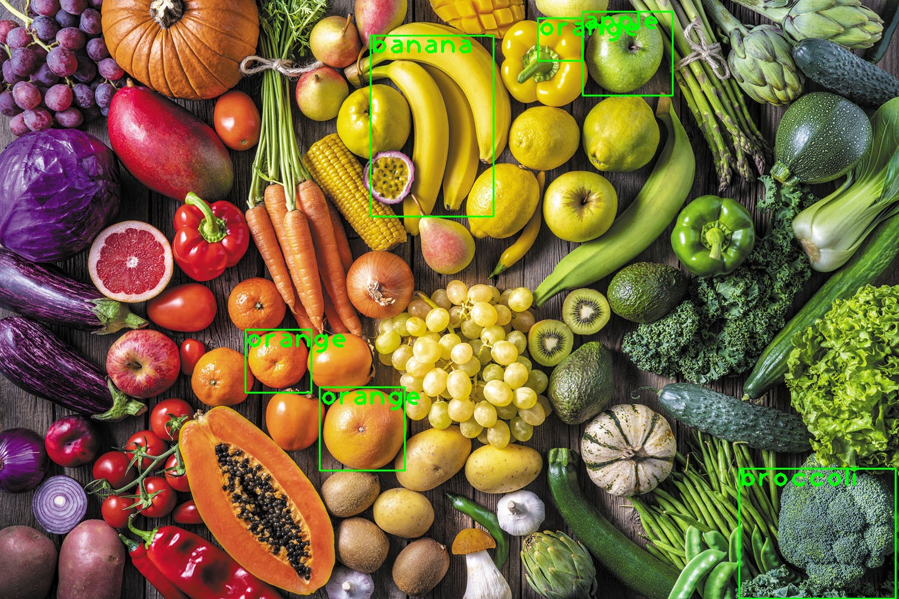
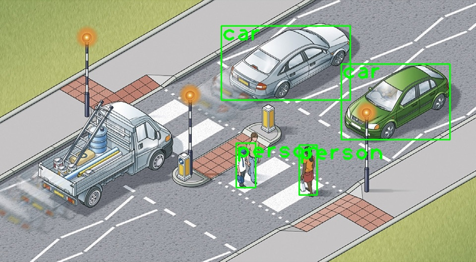
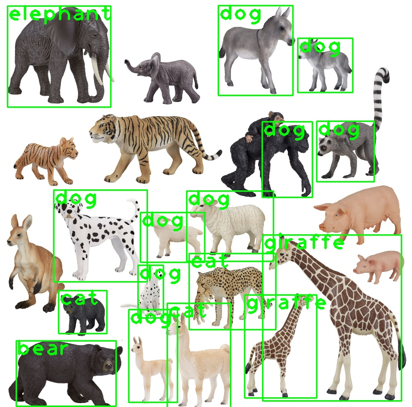

# Object Detection with YOLOv3

Hey there! I recently built this object detection project using YOLOv3 (You Only Look Once) to detect various objects in images. It's been a great learning experience working with computer vision and deep learning!

## What's This Project About?

This project uses YOLOv3, a state-of-the-art object detection algorithm, to identify and locate objects in images. YOLOv3 is particularly interesting because it uses a single neural network to predict bounding boxes and class probabilities directly from full images in one evaluation. This makes it incredibly fast and efficient compared to traditional two-stage detectors.

The model is pre-trained on the COCO (Common Objects in Context) dataset, which is a large-scale object detection, segmentation, and captioning dataset. COCO contains 80 different object categories, including people, vehicles, animals, and everyday items. The COCO names file provides the class labels that our model uses to identify objects in the images.

## How It Works

The project follows these main steps:
1. Loads the pre-trained YOLOv3 model and COCO class labels
2. Processes input images through the model
3. Detects objects and their locations
4. Draws bounding boxes and labels around detected objects
5. Saves the results with visual annotations

The YOLOv3 architecture uses a feature extraction network (Darknet-53) followed by multiple detection layers at different scales. This multi-scale detection approach helps the model detect objects of various sizes effectively. The model outputs bounding boxes, confidence scores, and class probabilities for each detected object.

## Performance and Observations

After testing the model on various images, I noticed some interesting patterns:

- **Strong Performance**:
  - People detection works really well, even in different poses and distances
  - Cars and vehicles are detected with high accuracy
  - Fruits and vegetables are identified clearly
  - Common household items are recognized reliably

- **Areas for Improvement**:
  - The model sometimes struggles with animal detection, especially dogs
  - It can be less accurate with smaller objects in the background
  - Some complex scenes with multiple overlapping objects can be challenging

## Example Results

Here are some examples of the model in action:

*Detecting people and objects in a street scene*

*Identifying various objects in an indoor setting*

*Object detection in a complex environment*

I'm also planning to extend this project to include real-time video processing, which would allow for continuous object detection in video streams. This would be particularly useful for applications like surveillance, autonomous vehicles, and interactive systems.

Feel free to check out the code and let me know if you have any questions or suggestions! 